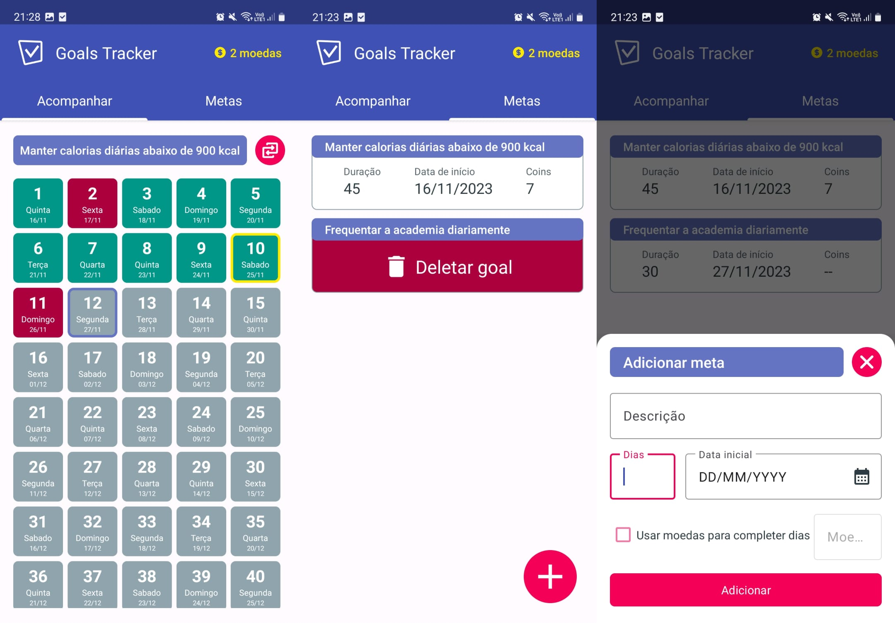
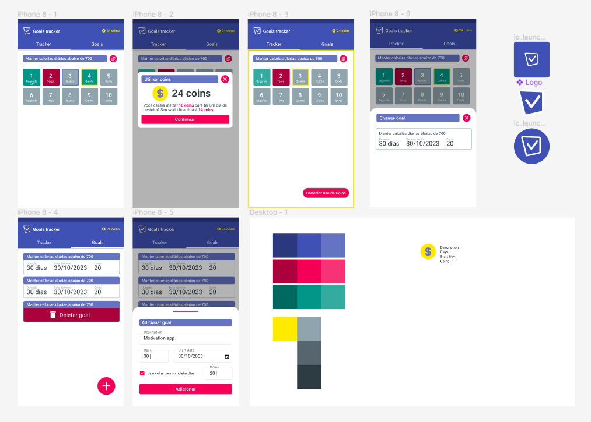

#  Goals Tracker

A native mobile app that helps users track their daily goals and routines.

**Goals Tracker** is a small project to help me learn native mobile development. It's built with Kotlin and `.xml` layouts.

    

[Note: `Jetpack Compose` was not used because a lot of old apps and libs still use `.xml` layouts]

With the app, the user can:

- Register goals informing: name, duration, start, coin threshold, and date.
- Delete goals
- See the goal days in a grid format.
- Switch between differennt goals in the grid format.
- Interact with the grid by the following rules.
  - Checking the current day meaning you completed the task (green card).
  - Not checking the current day meaning you didn't complete the task (red card).
  - Using coins to unlock a **Cheat Day** (green and gold card).

Additional rules include:

- Every day marked as completed earns you 1 coin.
- If the user accumulates the same or more coins than the goal threshold, they can use a **Cheat Day**
- The **Cheat Day** allows users to designate a day where they couldn't complete the task without affecting the completion record. It's like a day off.

### Technologies

    

I'm currently in a weight loss journey, so I decided to make this app as a way for me to better keep track of my progress. For that, I used.

- Figma for the initial prototype and logo.
- Kotlin as the main programming language (seems it's become standard over Java).
- MVVM as the state management solution.
- Google Material for some UI components.
- SQLite for internal storage.
